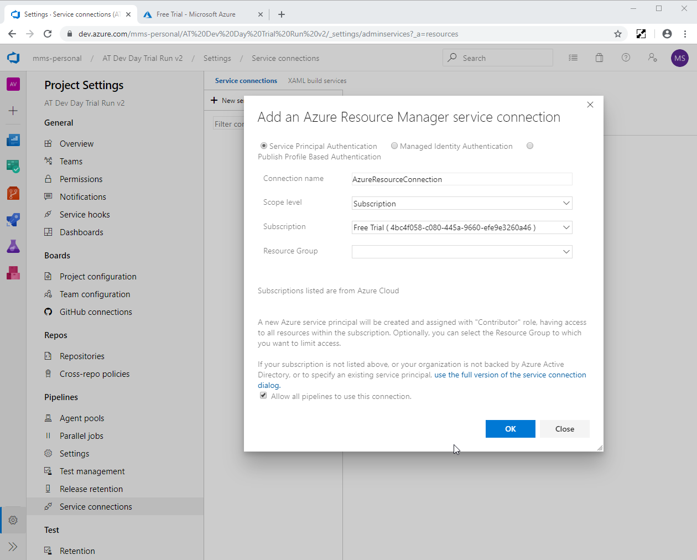
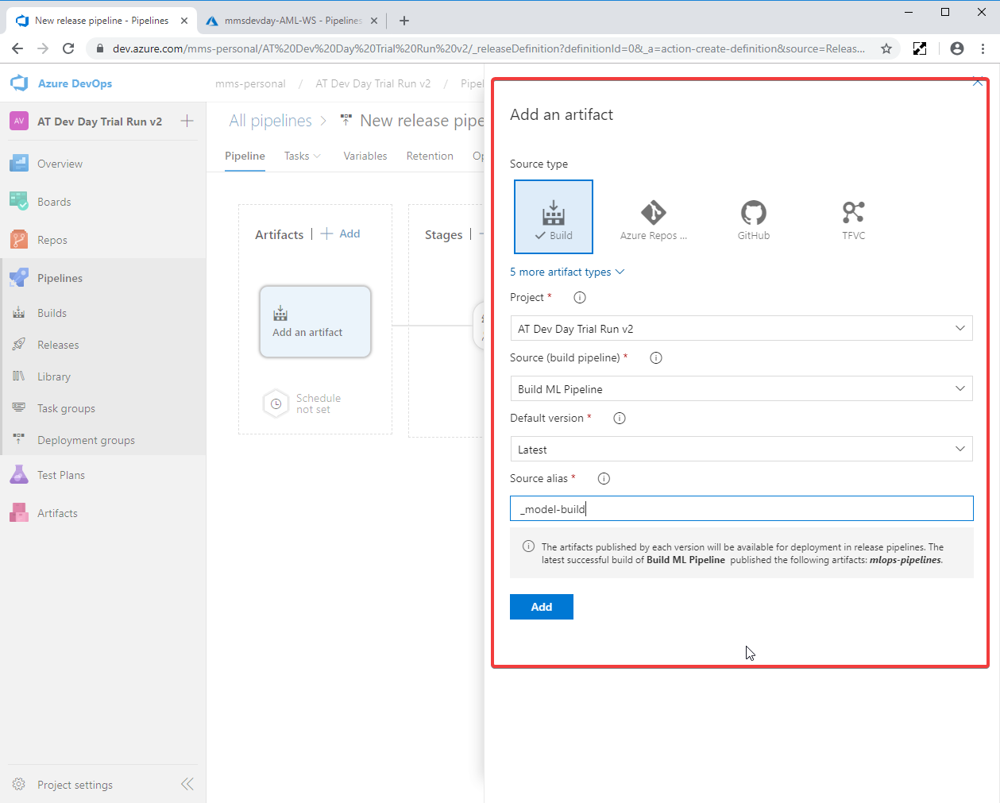
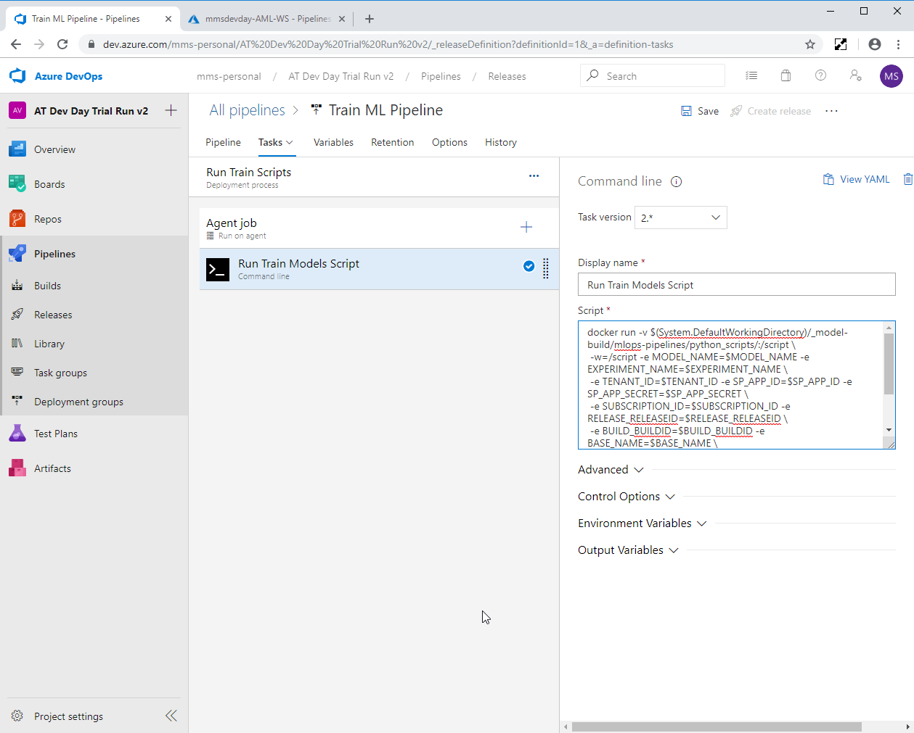
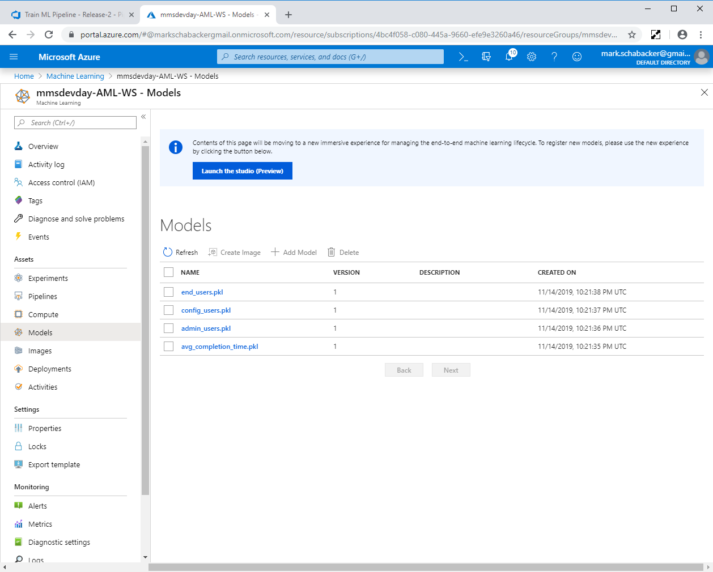
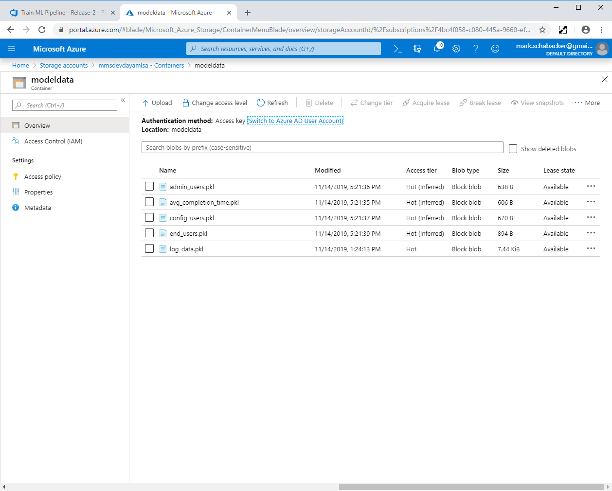

# AgileThought MS Dev Day Workshop

## Context

Today, we'll be discussing and developing an Azure DevOps pipeline wrapped around an Azure MLOps pipeline to proactively scale a Kubernetes cluster based on Machine Learning predictions.

At the end of the workshop, your Azure account will contain a working instance of this configuration for reference and experimentation.

We have included three Azure DevOps "challenges" over the course the workshop.  We will update this documentation with solutions to these challenges as we go.

## Steps

### Azure and Azure DevOps Setup

> NOTE: This workshop is going to involve provisioning and configuring Azure resources such as ML Pipelines, Kubernetes Clusters, Azure Active Directory App Registrations, and Azure DevOps projects.  If you already have a corporate Azure account, there's a good chance that you do not have permission to take these actions.  If that's the case, we recommend that you sign up for a fresh Azure Free Account.

1. Create a new Azure DevOps Free Account *(if necessary)*
    - Navigate to https://azure.microsoft.com/en-us/free/
    - Select the "Start free" button
1. Create a new Azure DevOps Organization *(if necessary)* ([docs](https://docs.microsoft.com/en-us/azure/devops/organizations/accounts/create-organization?view=azure-devops))
    - Navigate to https://azure.microsoft.com/en-us/pricing/details/devops/azure-devops-services/
    - Select the Basic Plan column's "Start free >" button
1. Create a new Azure DevOps Project ([docs](https://docs.microsoft.com/en-us/azure/devops/organizations/projects/create-project?view=azure-devops&tabs=browser))
    - `Azure DevOps Organization Screen -> + New project (top right)`
1. Clone the source repo into your project
    - `Sidebar -> Repos -> Import -> https://github.com/agilethought/MS-Dev-Day-Nov-2019`  
    
1. Create a new Service Principle in Azure Active Directory ([docs](https://docs.microsoft.com/en-us/azure/active-directory/develop/howto-create-service-principal-portal))
    - `Portal -> Azure Active Directory -> App registrations -> + New Registration`
        - Name: `atmsdevdayapp`
        - Supported account types: Accounts in this organizational directory only
        - Redirect URI: leave empty
    - "Register" and record the following:
        - Application (client) ID
        - Directory (tenant) ID
    - Create a Client Secret
        - `Portal -> AAD -> App Registrations -> <This Registration> -> Certificates & secrets -> New client secret`
            - Description: AT Dev Day Client Secret
            - Expires: Never
        - Record Client Secret value  
        
1. Capture Configuration Data in an Azure DevOps Variable Group
    - `Azure DevOps Project -> Sidebar -> Pipelines -> Library -> Variable Groups -> "+ Variable group`
        - Variable group name: `devopsforai-aml-vg`
        - Add the following variables:

            | Variable Name | Suggested Value |
            | ------------- | --------------- |
            | AML_COMPUTE_CLUSTER_NAME | `train-cluster` |
            | BASE_NAME | `<your-initials>devday` |
            | EXPERIMENT_NAME | `mlopspython` |
            | LOCATION | `eastus` |
            | MODEL_NAME | `sklearn_regression_model.pkl` |
            | SOURCES_DIR_TRAIN | `python_scripts` |
            | SP_APP_ID | `<Application (client) ID from above>` |
            | SP_APP_SECRET | `<Client Secret Value from above>` |
            | SUBSCRIPTION_ID | `<Azure Subscription ID>` |
            | TENANT_ID | `<Directory tenant) ID from above>` |
            | TRAIN_SCRIPT_PATH | `train.py` |
            | TRAINING_PIPELINE_NAME | `training-pipeline` |
1. Create an Azure Resource Manager Service Connection ([docs](https://docs.microsoft.com/en-us/azure/devops/pipelines/library/service-endpoints?view=azure-devops&tabs=yaml#create-a-service-connection))
    - `Azure DevOps Project Sidebar -> Project settings -> Pipelines -> Service connections -> + New service connection -> Azure Resource Manager`
        - Connection Name: `AzureResourceConnection`
        - Scope Level: `Subscription`
        - Subscription: `<Your Azure Subscription>`
        - Resource Group: Leave Blank  
    
1. Create a Build to Provision Azure Resources
    1. `Azure DevOps Project Sidebar -> Pipelines -> Builds -> New pipeline`
        - Where is your code?: `Azure Repos Git`
        - Select your imported repo
        - Configure your pipeline: `Existing Azure Pipelines YAML file`
            - Branch: `master`
            - Path: `/build_pipeline_scripts/iac-create-environment.yml`
        - Suggested Name: `Provision Azure Environment`
    1. Run the Build
        - `Newly Created Build Pipeline -> Run` (This will take a few minutes!)
    1. Verify Azure Resource Creation
        - `Azure Portal -> Resource groups -> <Your Newly Created Resource Group>`
        - Verify that 5 resources have been created:  
        

Congratulations!  You have configured the large majority of the Azure resources necessary for this workshop.

## Create the ML Pipeline

1. Add your Service Principal as a Contributor on the ML Workspace ([docs](https://github.com/Azure/MachineLearningNotebooks/blob/master/how-to-use-azureml/manage-azureml-service/authentication-in-azureml/authentication-in-azureml.ipynb))
    - `Azure Portal -> Machine Learning -> <Your ML Workspace> -> Access control (IAM) -> Add Role Assignment`
        - Role: `Contributor`
        - Assign access to: `Azure AD user, group, or service principle`
        - Select: `<Your Service Principle name>`  
    
1. Create a Blob Container and Load Log Data
    1. `Azure Portal -> Storage Accounts -> <Your Storage Account> -> Blob Service -> Containers > + Container`
        - Name: `modeldata`
        - Public access level: `Private (no anonymous access)`
    1. Select the newly created `modeldata` container
        - Download [`log_data.pkl`](https://github.com/agilethought/MS-Dev-Day-Nov-2019/raw/master/data/log_data.pkl)
        - Upload (top left)
            - File: `log_data.pkl` that you just downloaded
1. Add Service Principal to Storage Account
    - `Azure Portal -> Storage Accounts -> <Your Storage Account> -> Access control (IAM) -> Add Role Assignment`
        - Role: `Contributor`
        - Assign access to: `Azure AD user, group, or service principle`
        - Select: `<Your Service Principle name>`
1. Capture Blob Storage Variable Group Entries
    - `Azure DevOps Project -> Sidebar -> Pipelines -> Library -> Variable Groups -> devopsforai-aml-vg`
        - Add the following variables:

            | Variable Name | Suggested Value |
            | ------------- | --------------- |
            | STORAGE_ACCT_NAME | `<Blob Storage Container Name>` |
            | STORAGE_ACCT_KEY | `<Azure Portal -> Storage Accounts -> <Your Storage Account> -> Settings -> Access Keys>` |
            | STORAGE_BLOB_NAME | `modeldata` |
1. Create an Azure DevOps Build to Create the ML Pipeline
    1. `Azure DevOps Project Sidebar -> Pipelines -> Builds -> New pipeline`
        - Where is your code?: `Azure Repos Git`
        - Select your imported repo
        - Configure your pipeline: `Existing Azure Pipelines YAML file`
            - Branch: `master`
            - Path: `/build_pipeline_scripts/model-build.yml`
        - Suggested Name: `Build ML Pipeline`
    1. Run the Build
        - `Newly Created Build Pipeline -> Run` (This will take a few minutes!)
        - Verify that ML Pipeline was created
            - `Azure Portal -> Machine Learning -> <Your ML Workspace> -> Pipelines`
            - You should see a pipeline named `training-pipeline`  
            

Congratulations!  You have created an Azure ML Pipeline.  We will train the pipeline in the next section.

## Train the ML Pipeline
1. Create a New Azure DevOps Release
    1. `Azure DevOps Project Sidebar -> Pipelines -> Releases -> New pipeline`
        - Start With: `Empty Job`
            - Stage Name: `Run Train Scripts`
    1. Update name to `Train ML Pipeline`
    1. Add an Artifact
        - Source Type: `Build`
        - Source: `Build ML Pipeline` (the pipeline created from `model-build.yml`)
        - Default version: `Latest`
        - Source Alias: `_model-build`  
        
    1. Link the Variable Group
        - `Train ML Pipeline Release -> Variables Tab -> Variable groups`
        - Link Variable Group: `devopsforai-aml-vg`
    1. Update to Ubuntu Agent
        1. Navigate into Tasks for the Release
        2. Select the "Agent Job"
        3. Update Agent Specification: `ubuntu-16.04`
    1. Add Command Line Task
        1. Click the "+" (Add task to an Agent Job) button in the `Agent Job` item
        1. Add a `Command line` task
        1. Select the new `Command Line Script` task and set the following
            - Display Name: `Run Train Models Script`
            - Script:
            ```
            docker run -v $(System.DefaultWorkingDirectory)/_model-build/mlops-pipelines/python_scripts/:/script \
            -w=/script -e MODEL_NAME=$MODEL_NAME -e EXPERIMENT_NAME=$EXPERIMENT_NAME \
            -e TENANT_ID=$TENANT_ID -e SP_APP_ID=$SP_APP_ID -e SP_APP_SECRET=$SP_APP_SECRET \
            -e SUBSCRIPTION_ID=$SUBSCRIPTION_ID -e RELEASE_RELEASEID=$RELEASE_RELEASEID \
            -e BUILD_BUILDID=$BUILD_BUILDID -e BASE_NAME=$BASE_NAME \
            -e STORAGE_ACCT_NAME=$STORAGE_ACCT_NAME -e STORAGE_ACCT_KEY=$STORAGE_ACCT_KEY -e STORAGE_BLOB_NAME=$STORAGE_BLOB_NAME \
            mcr.microsoft.com/mlops/python:latest python run_train_pipeline.py
            ```  
            
    1. Run the Release
        - Verify that models are created
            - `Azure Portal -> Machine Learning -> <Your ML Workspace> -> Models`  
            
        - Verify that models exist in blob storage
            - `Azure Portal -> Storage Accounts -> <Your Storage Account> -> Blob Service -> Containers -> <Your Container> -> modeldata`  
            

Congratulations!  You've trained your models.  We will create an AKS Cluster in the next section.

## Challenge 3 - Create the AKS Cluster in a new Resource Group

In this section, we will be creating an AKS cluster to proactively scale.  Your challenge is to create an AKS cluster with the following specification:

- Resource Group Name: `atDevDayWorkshopRg`
- Name: `atDevDayCluster`
- Node Count: `1`
- Auto-Scaling: `disabled`

Documentation can be found at: [Quickstart: Deploy an Azure Kubernetes Service cluster](https://docs.microsoft.com/en-us/azure/aks/kubernetes-walkthrough)

Raise your hand when complete. The first completion will receive a raffle entry!